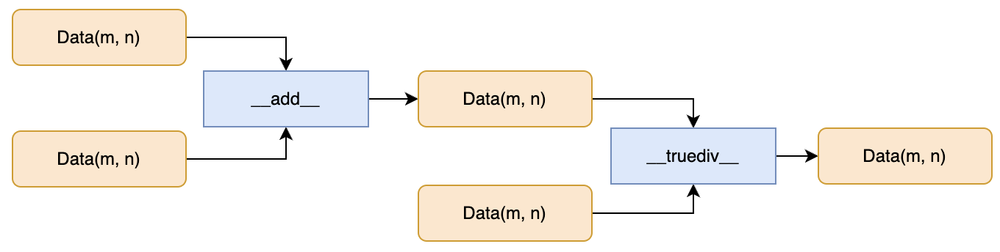
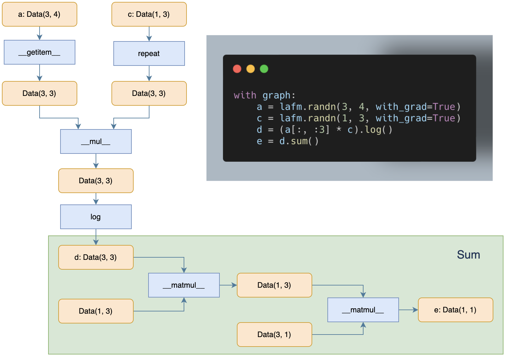
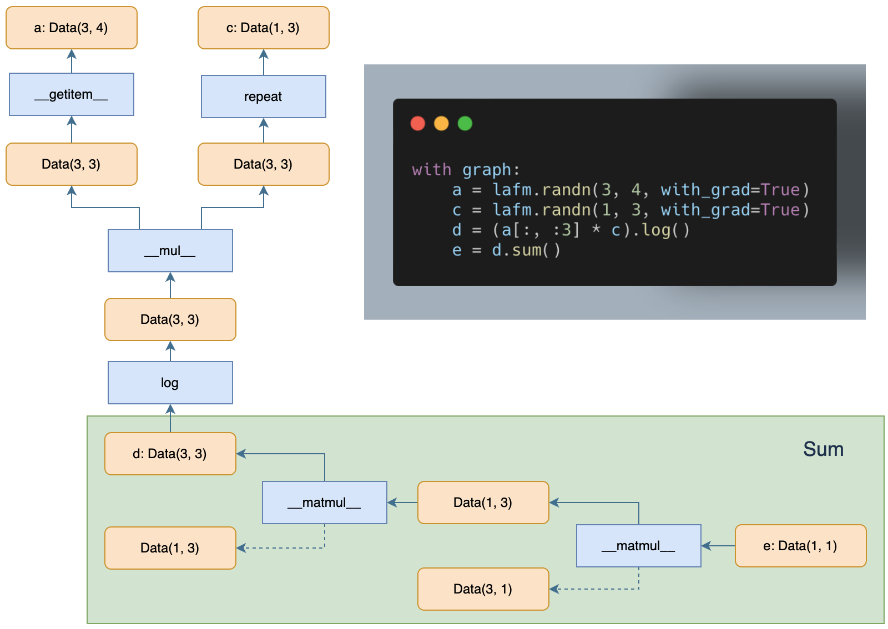
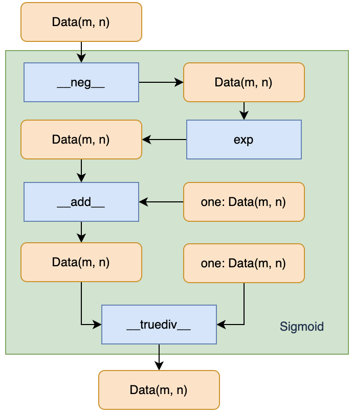
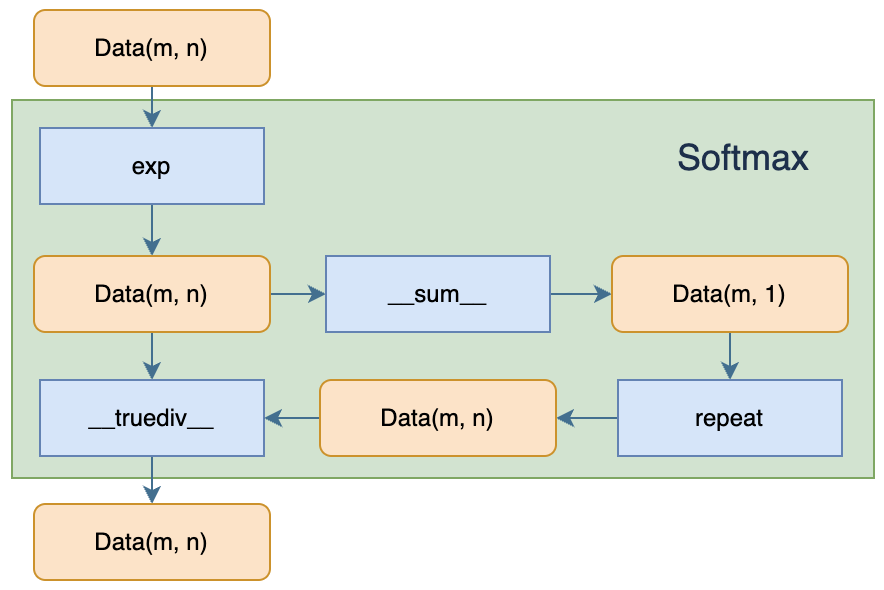
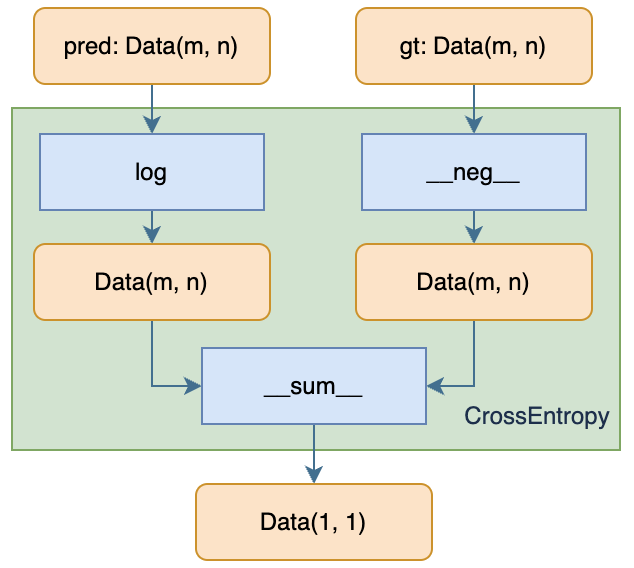
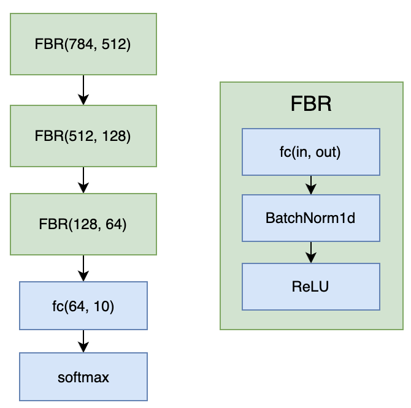

<!-- LANG:ZH -->

# 实现细节

## 计算图

### 基本类

要完成一个完整的自动微分的框架需要两个基本的类：计算图、矩阵计算类

​	计算图核心的数据结构包括了，图、操作数结点、操作符结点。各数据结构的作用如下：

- 计算图 `comp_graph`：主要有如下作用：
  - 基础的图结构：对于不同且无交集的计算过程，我们需要用不同的图结构用于存储。图结构存储的信息包括计算过程中参与的操作数结点、操作符结点集合，以及用于指示是否需要对结点进行拓扑排序的 `_need_sort` 字段。
  - 管理新结点的加入：通过对 `Mat` 类运算符的重写与包装，任何涉及到 `Mat` 的计算过程都将在计算后执行一段用于创建新结点并将其加入处于当前上下文的计算图当中的代码，以保证计算记录的正常运行。同时还提供了清除整个图结构结点的功能。
  - 启动运算过程：在计算图中还有十分重要的两个方法用于启动图中记录好的计算图，它们是 `backward` 与 `forward`。其中 `backward` 用于执行梯度的反向传播，通过在拓扑排序好的结点上逐一遍历并计算结点梯度，来完成整个图的梯度传播。而 `forward` 则是用于执行其前向过程，但由于没有实现好数据的 `Placeholder` 结构，因此 `forward` 的使用方式并不固定，也会有可能输出错误的计算结果，一般情况直接输出对应的计算结果即可。



- 结点 `_node` ：操作数结点 `_data_node` 继承自 `_node` ，其主要用于存储对应的操作数数据 `Mat` 对象以及其是通过何种算子计算而得，主要用于在反向传播中读取 `Mat` 对象中的 `grad` 属性。操作符结点 `_operator_node` 也继承自 `_node` ，它是反向传播的核心，因为操作符决定了每一个结点梯度计算的公式，该类结点主要记录的参数包括结点类型以及算子调用的关键字参数。

​	矩阵计算类的实现主要是基于 `numpy` 实现，通过官方文档提供的信息，我新建了一个 `Mat` 类以继承 `numpy.ndarray` ，并重写了 `__new__` 与 `__array_finalize__` 两个核心的方法并添加了 `with_grad` 与 `grad` 字段，前者有用指示当前矩阵是否需要计算梯度，后者记录其梯度计算结果，它们与 `torch.Tensor` 中的 `requires_grad` 和 `grad ` 的作用基本一致。尽管计算记录的核心实现在于计算图，但是要完成计算过程的追踪还需要装饰器来包装 `Mat` 的诸多基本运算符，以实现简易的计算图构建过程。

### 前向过程

​	前向过程主要是计算过程的记录，要开始一个前向过程的记录，我们需要先创建一个计算图，并将其设置为当前的上下文，以下图的代码为例，一个完整的计算图的记录如下，在这个示例中，除了常见的基本运算与索引以外，在变量 `c` 后有一个未在代码计算过程出现的操作：`repeat` ，`repeat` 操作的添加是为了防止 `ndarray` 在计算过程中自动的 boardcast 操作导致计算图的断链，从而导致梯度传播在中途断开，此外还需要实现 `reshape` 操作的记录，两者的作用均是用于保证矩阵计算过程的可追踪性。



​	图中可以看到个人实现的计算图一个显著的特点就是操作数结点与操作符结点的交替出现，因此从更高层的神经网络模块的角度来看，对于一些常见的复合模块，如 `Conv2d` + `BatchNorm2d` + `ReLU` 等，可以利用多层融合的方式来减少中间结点的出现以减小空间占用，以及结点遍历的时间占用。

### 后向过程

​	后向过程主要完成反向传播的任务，将梯度从图的末端（同时也是拓扑排序的最后一个元素）传播到各个需要计算梯度的结点之上。要开始一个反向传播的过程，只需要对定义好的 `comp_graph` 调用其 `backward` 方法，梯度则会按照下图的方向累加到各个数据结点之上。下图是一个反向传播梯度流动方向的示意图，从图中可以看出，由于有些结点并不需要计算梯度，因此传播过程会跳过对应的结点。



​	反向传播的过程需要根据算子类型分别调用对应的梯度计算公式，并将其累加到需要计算梯度的操作数之上，梯度累加的过程需要分别提供算子的输入输出矩阵、被求导的元素以及算子执行的关键字参数，以完成梯度反向传播的任务，以索引的梯度计算为例：

```python
def _getitem_grad(input_X: Mat, result_Z: Mat, cal_grad: int, **kwargs):
    if cal_grad == 0:
        slices = kwargs['slices']
        input_X.grad[slices] += result_Z.grad
	else:
        raise NotImplementedError
```

​	由于索引操作只有一个输入 `input_X` ，因此仅当 `cal_grad == 0` 时这一梯度运算函数才有意义，此时要完成梯度传播需要先获取索引的切片参数，随后将运算结果 `result_Z` 的梯度传递到算子输入 `input_X` 当中，在此处的具体实现也就是将梯度累加到对应索引切片的梯度当中。在复杂的计算图中，矩阵 `input_X` 与 `result_Z` 的角色是不断切换的，这个传播过程将会从计算图的终端结点不断执行，直到传播过程到达图中的叶结点为止。此外，为了确保反向传播过程中结点遍历顺序的正确性，计算图会先经历一次拓扑排序，以避免出现前一结点的梯度还未累加完就作为计算的输出向其上一层累加梯度，从而导致梯度的数值出现错误。

## 算子

​	在此处的算子指的是对输入的 `Mat` 结构数据进行数学运算并生成输出的 `Mat` 数据的函数或操作。一个算子的定义既包括前向过程的定义，同时也包括了后向过程的梯度计算定义。为了实现更灵活简洁的算子，需要实现 9 个**基本算子**以及**逐元素算子**，结合这些算子可以构建出更复杂的算子，且同时也不需要再额外编写对应的后向过程的梯度定义，使得增加新的算子会更加方便快捷。

### 基本算子

​	基本算子主要包括 9 种：矩阵逐元素四则运算、矩阵乘法、矩阵转置、矩阵元素索引、boardcast 以及 reshape 操作。

#### 矩阵逐元素四则运算

​	这一类计算要求参与计算的两个操作数矩阵均有相同的维度与形状，其数学公式可以按照矩阵逐元素求导的定义出发，以矩阵加法为例，我们构建一个完整的计算流程，终端结点为常数,设：
$$\mathbf{A}\in \mathbb{R}^{m\times n},\ \mathbf{B}\in \mathbb{R}^{m\times n},\ \mathbf{C}\in \mathbb{R}^{m\times n}$$
​	计算过程如下：
$$\mathbf{A}+\mathbf{B}=\mathbf{C}\\ f(\mathbf{C})\in \mathbb{R$$
​	假设我们需要求出矩阵 $\mathbf{A}$ 的梯度，即计算 $\frac{\partial f(\mathbf{C})}{\partial \mathbf{A}}$ ，根据链式求导有：
$$\frac{\partial f(\mathbf{C})}{\partial \mathbf{A}}=\frac{\partial f(\mathbf{C})}{\partial \mathbf{C}}\cdot\frac{\partial \mathbf{C}}{\partial \mathbf{A}},\\
\frac{\partial f(\mathbf{C})}{\partial \mathbf{C}}\in\mathbb{R}^{m\times n},\ \frac{\partial \mathbf{C}}{\partial \mathbf{A}}\in\mathbb{R}^{m\times n\times m\times n}$$
​	显然根据反向传播的过程，在计算加法梯度这一步 $\frac{\partial f(\mathbf{C})}{\partial \mathbf{C}}$ 已经计算完毕，因此这一步的关键在于如何计算 $\frac{\partial \mathbf{C}}{\partial \mathbf{A}}\in\mathbb{R}^{m\times n\times m\times n}$ 。首先，我们可以将这一矩阵以如下方式表达：
$$
\frac{\partial \mathbf{C}}{\partial \mathbf{A}}[i, j]=\frac{\partial \mathbf{C}[i, j]}{\partial \mathbf{A}}\in\mathbb{R}^{m\times n}
$$
​	 这一公式的含义也就是对于矩阵 $\mathbf{C}$ 中第 $[i,j]$ 个元素对矩阵 $\mathbf{A}$ 求导，这一结果是显而易见的，因为矩阵 $\mathbf{A}$ 中仅有第 $[i,j]$ 个元素参与了矩阵 $\mathbf{C}[i,j]$ 的计算，因此计算结果将是一个除了第 $[i,j]$ 个元素为 $1$ 以外全为 $0$ 的矩阵。依据这一结论我们可以计算出 $\frac{\partial \mathbf{C}}{\partial \mathbf{A}}$ 结果：
$$
\begin{bmatrix}
\begin{bmatrix}
    1 & 0 & \cdots & 0 \\
    0 & 0 & \cdots & 0 \\
    \vdots & \vdots & \ddots & \vdots \\
    0 & 0 & \cdots & 0
\end{bmatrix} & 
\begin{bmatrix}
    0 & 1 & \cdots & 0 \\
    0 & 0 & \cdots & 0 \\
    \vdots & \vdots & \ddots & \vdots \\
    0 & 0 & \cdots & 0
\end{bmatrix} &
\cdots & 
\begin{bmatrix}
    0 & 0 & \cdots & 1 \\
    0 & 0 & \cdots & 0 \\
    \vdots & \vdots & \ddots & \vdots \\
    0 & 0 & \cdots & 0
\end{bmatrix} \\
\begin{bmatrix}
    0 & 0 & \cdots & 0 \\
    1 & 0 & \cdots & 0 \\
    \vdots & \vdots & \ddots & \vdots \\
    0 & 0 & \cdots & 0
\end{bmatrix} &
\begin{bmatrix}
    0 & 0 & \cdots & 0 \\
    0 & 1 & \cdots & 0 \\
    \vdots & \vdots & \ddots & \vdots \\
    0 & 0 & \cdots & 0
\end{bmatrix} &
\cdots &
\begin{bmatrix}
    0 & 0 & \cdots & 0 \\
    0 & 0 & \cdots & 1 \\
    \vdots & \vdots & \ddots & \vdots \\
    0 & 0 & \cdots & 0
\end{bmatrix} \\
\vdots & \vdots & \ddots & \vdots \\
\begin{bmatrix}
    0 & 0 & \cdots & 0 \\
    0 & 0 & \cdots & 0 \\
    \vdots & \vdots & \ddots & \vdots \\
    1 & 0 & \cdots & 0
\end{bmatrix} &
\begin{bmatrix}
    0 & 0 & \cdots & 0 \\
    0 & 0 & \cdots & 0 \\
    \vdots & \vdots & \ddots & \vdots \\
    0 & 1 & \cdots & 0
\end{bmatrix} &
\cdots &
\begin{bmatrix}
    0 & 0 & \cdots & 0 \\
    0 & 0 & \cdots & 0 \\
    \vdots & \vdots & \ddots & \vdots \\
    0 & 0 & \cdots & 1
\end{bmatrix}
\end{bmatrix}
$$
​	这是一个大小为 $m\times n$ 的矩阵，其中每个元素也是一个大小为 $m\times n$ 的矩阵。但是为了能够和项 $\frac{\partial f(\mathbf{C})}{\partial \mathbf{C}}$ 进行计算，我们需要先对其元素进行向量化，也就是将每个矩阵元素压缩成 $1\times mn$ 的元素，并将这些元素按行进行排列，即最终得到一个 $mn\times mn$ 的矩阵，根据简单的推导可以知道这一矩阵为一个单位矩阵 $\mathbf{I}_{mn\times mn}$ ，同时对项 $\frac{\partial f(\mathbf{C})}{\partial \mathbf{C}}$ 也需要进行向量化，得到一个 $1\times mn$ 的矩阵。此时可以开始计算：$\frac{\partial f(\mathbf{C})}{\partial \mathbf{C}}\cdot\frac{\partial \mathbf{C}}{\partial \mathbf{{A}}}$，由于两个元素中后者是单位矩阵，因此将两者相乘可以得到一个与原矩阵一致的结果，由于 $\mathbf{A}$ 本身是一个维度为 $m\times n$ 的矩阵，因此将 $1\times mn$ 的矩阵展开后即刻得到 $\mathbf{A}$ 的梯度，在这里也就是矩阵 $\frac{\partial f(\mathbf{C})}{\partial \mathbf{C}}$ 本身，因此最后的代码实现如下：

```python
def _add_grad(input_X: Mat, input_Y: Mat, result_Z: Mat, cal_grad: int, **kwargs):
    inp = [input_X, input_Y]
    inp[cal_grad].grad += result_Z.grad
```

​	同理可推得其他三个算子的梯度公式应该如下：

```python
def _sub_grad(input_X: Mat, input_Y: Mat, result_Z: Mat, cal_grad: int, **kwargs):
    inp = [input_X, input_Y]
    inp[cal_grad].grad += result_Z.grad * (-1) ** cal_grad


def _mul_grad(input_X: Mat, input_Y: Mat, result_Z: Mat, cal_grad: int, **kwargs):
    inp = [input_X, input_Y]
    inp[cal_grad].grad += result_Z.grad * inp[1 - cal_grad]


def _div_grad(input_X: Mat, input_Y: Mat, result_Z: Mat, cal_grad: int, **kwargs):
    if 0 == cal_grad:
        input_X.grad += result_Z.grad / input_Y
    elif 1 == cal_grad:
        input_Y.grad += - result_Z.grad * input_X / (input_Y ** 2)
```

#### 矩阵乘法

​	矩阵乘法的求导计算相比逐元素相乘更为复杂一些，但原理一致，设：
$$
\mathbf{A}\in \mathbb{R}^{m\times k},\ \mathbf{B}\in \mathbb{R}^{k\times n},\ \mathbf{C}\in \mathbb{R}^{m\times n}
$$
​	计算过程如下：
$$
\mathbf{A}\times \mathbf{B}=\mathbf{C}\\ f(\mathbf{C})\in \mathbb{R}
$$
​	与前一节相似，假设我们需要求出矩阵 $\mathbf{A}$ 的梯度，即计算 $\frac{\partial f(\mathbf{C})}{\partial \mathbf{A}}$ ，根据链式求导有：
$$
\frac{\partial f(\mathbf{C})}{\partial \mathbf{A}}=\frac{\partial f(\mathbf{C})}{\partial \mathbf{C}}\cdot\frac{\partial \mathbf{C}}{\partial \mathbf{A}},\\
\frac{\partial f(\mathbf{C})}{\partial \mathbf{C}}\in\mathbb{R}^{m\times n},\ \frac{\partial \mathbf{C}}{\partial \mathbf{A}}\in\mathbb{R}^{m\times n\times m\times k}
$$
​	思路相似，首先列出项 $\frac{\partial \mathbf{C}}{\partial \mathbf{A}}\in\mathbb{R}^{m\times n\times m\times k}$ ，我们可以将其中的元素看作 $\frac{\partial \mathbf{C}}{\partial \mathbf{A}}[i, j]=\frac{\partial \mathbf{C}[i, j]}{\partial \mathbf{A}}\in\mathbb{R}^{m\times k}$，要写出其中的项，需要先回忆矩阵乘法的定义，思考元素 $\mathbf{C}[i,j]$ 如何计算得到的：
$$
\mathbf{C}[i,j]=\mathbf{A}[i, :] \times \mathbf{B}[:,j]
$$
​	因此我们可以很容易的知道 $\frac{\partial \mathbf{C}[i, j]}{\partial \mathbf{A}}$ 对应的矩阵中仅在第 $i$ 行有元素（因为 $\mathbf{A}$ 中仅有第 $i$ 行参与了计算），其对应的元素为 $\mathbf{B}[:,j]^\intercal$，因此我们就可以利用分块矩阵的方式写出  $\frac{\partial \mathbf{C}}{\partial \mathbf{A}}\in\mathbb{R}^{m\times n\times m\times k}$：
$$
\begin{bmatrix}
    \begin{bmatrix}
    \mathbf{B}[:, 0]^\intercal \\
    0 \\
    \vdots \\
    0
	\end{bmatrix}_{m\times k} &
	\begin{bmatrix}
    \mathbf{B}[:, 1]^\intercal \\
    0 \\
    \vdots \\
    0
	\end{bmatrix}_{m\times k} & \cdots &
	\begin{bmatrix}
    \mathbf{B}[:, n-1]^\intercal \\
    0 \\
    \vdots \\
    0
	\end{bmatrix}_{m\times k} \\
	\begin{bmatrix}
    0 \\
    \mathbf{B}[:, 0]^\intercal \\
    \vdots \\
    0
	\end{bmatrix}_{m\times k} &
	\begin{bmatrix}
    0 \\
    \mathbf{B}[:, 1]^\intercal \\
    \vdots \\
    0
	\end{bmatrix}_{m\times k} & \cdots &
	\begin{bmatrix}
    0 \\
    \mathbf{B}[:, n-1]^\intercal \\
    \vdots \\
    0
	\end{bmatrix}_{m\times k} \\
	\vdots & \vdots & \ddots & \vdots \\
	\begin{bmatrix}
    0 \\
    0 \\
    \vdots \\
    \mathbf{B}[:, 0]^\intercal
	\end{bmatrix}_{m\times k} &
	\begin{bmatrix}
    0 \\
    0 \\
    \vdots \\
    \mathbf{B}[:, 1]^\intercal
	\end{bmatrix}_{m\times k} & \cdots &
	\begin{bmatrix}
    0 \\
    0 \\
    \vdots \\
    \mathbf{B}[:, n-1]^\intercal
	\end{bmatrix}_{m\times k}
\end{bmatrix}_{m\times n}
$$
​	同理，利用矩阵向量化，我们可以获得一个 $mn\times mk$ 的矩阵，为了方便表示，首先设：
$$
\mathbf{M} = 
\begin{bmatrix}
    \mathbf{B}[:, 0]^\intercal  \\
    \mathbf{B}[:, 1]^\intercal & \\
    \vdots  \\
    \mathbf{B}[:, n-1]^\intercal
\end{bmatrix}_{n\times k}
$$
​	随后有：
$$
\frac{\partial \mathbf{C}}{\partial \mathbf{A}}=
\begin{bmatrix}
    \mathbf{M} & \bold 0_{n\times k} & \cdots & \bold 0_{n\times k} \\
    \bold 0_{n\times k} & \mathbf{M} & \cdots & \bold 0_{n\times k} \\
    \vdots & \vdots & \ddots & \vdots \\
    \bold 0_{n\times k} & \bold 0_{n\times k} & \cdots & \mathbf{M}
\end{bmatrix}_{mn\times mk}
$$
​	此时计算 $\frac{\partial f(\mathbf{C})}{\partial \mathbf{C}}\cdot\frac{\partial \mathbf{C}}{\partial \mathbf{A}}$ ，记 $\frac{\partial f(\mathbf{C})}{\partial \mathbf{C}}[i,j]=f_{ij}$ 有如下：
$$
\begin{bmatrix}
    f_{00} & f_{01} & \cdots & f_{mn} 
\end{bmatrix} \cdot
\begin{bmatrix}
    \mathbf{M} & \bold 0_{n\times k} & \cdots & \bold 0_{n\times k} \\
    \bold 0_{n\times k} & \mathbf{M} & \cdots & \bold 0_{n\times k} \\
    \vdots & \vdots & \ddots & \vdots \\
    \bold 0_{n\times k} & \bold 0_{n\times k} & \cdots & \mathbf{M}
\end{bmatrix} =
\mathbf{N}_{1\times mk}
$$
​	通过逐一带入计算可以找到如下规律：
$$
\mathbf{N}[i*j] =\frac{\partial f(\mathbf{C})}{\partial \mathbf{C}}[i,:]\times  \mathbf{B}[j, :]=\frac{\partial f(\mathbf{C})}{\partial \mathbf{C}}[i,:]\times \mathbf{B}[:, j]^\intercal
$$
​	根据观察可以得到其矩阵乘法的形式：
$$
\mathbf{N}_{m\times k}=\frac{\partial f(\mathbf{C})}{\partial \mathbf{A}}=\frac{\partial f(\mathbf{C})}{\partial \mathbf{C}}\times \mathbf{B}^\intercal
$$
​	同理可得 $\frac{\partial f(\mathbf{C})}{\partial \mathbf{B}}=\mathbf{A}^\intercal\times \frac{\partial f(\mathbf{C})}{\partial \mathbf{C}}$，因此最终实现的梯度运算代码如下：

```python
def _matmul_grad(input_X, input_Y, result_Z, cal_grad: int, **kwargs):
    if cal_grad == 0:
        input_X.grad += result_Z.grad @ input_Y.T
    if cal_grad == 1:
        input_Y.grad += input_X.T @ result_Z.grad
```

​	尽管矩阵求导术可以直接获得这一结论，但实际上许多操作，如切片、`reshape` 等求导的结果需要根据矩阵求导的定义才能很好的理解。

#### 矩阵转置

​	矩阵转置的梯度传播过程十分简单，根据定义，只需要将计算结果的梯度直接进行转置并赋值即可，代码实现如下：

```python
def _transpose_grad(input_X: Mat, result_Z: Mat, cal_grad: int, **kwargs):
    if cal_grad == 0:
        input_X.grad += result_Z.grad.T
```

#### 矩阵元素索引

​	矩阵元素索引的求导也可直接通过定义获得，将计算结果的梯度添加到对应切片的元素上即可：

```python
def _getitem_grad(input_X: Mat, result_Z: Mat, cal_grad: int, **kwargs):
    if cal_grad == 0:
        slices = kwargs['slices']
        input_X.grad[slices] += result_Z.grad
    else:
        raise NotImplementedError
```

#### boardcast (repeat 以及 reshape) 

​	`boardcast`（即实现代码中的 `repeat` 与 `reshape` 操作的组合）主要用于控制计算的可追踪性与可计算性，它可以将一些向量与矩阵的运算广播成矩阵与矩阵的运算，这样可以大大简化逐元素运算的求导过程，同时保证了计算过程不会出现 `numpy` 自动调用的 `boardcast` 运算导致计算图的记录断链。

​	其中 `repeat` 是将向量按照某个维度进行多次复制，而 `reshape` 操作则是结合 `repeat` 操作一同，完成将低维向量扩伸到高维矩阵这一任务，两者确保了自动的 `boardcast` 的过程不会发生，而是被它们取代，`_boardcast` 函数的实现细节如下：

```python
def _boardcast(x, shape):
    if not comp_graph._graph_recording or x.shape == shape:
        return x
    if x.ndim != len(shape):
        if x.shape[0] == shape[0]:
            return x.reshape(-1, 1).repeat(shape[1], axis=1)
        elif x.shape[0] == shape[1]:
            return x.reshape(1, -1).repeat(shape[0], axis=0)
    else:
        if x.shape[0] != shape[0]:
            return x.repeat(shape[0], axis=0)
        elif x.shape[1] != shape[1]:
            return x.repeat(shape[1], axis=1)
```

### 逐元素算子

​	逐元素算子包括了许多对矩阵主元素操作的运算符号，比如 `exp`, `log`, `pow` 等，它们的求导结果可以根据**矩阵逐元素四则运算**的推导得到，可以直接通过固定的范式进行定义：

```python
def _gen_elem_grad(elem_wise_grad):
    def _elem_grad(input_X: Mat, result_Z: Mat, cal_grad: int, **kwargs):
        input_X.grad += elem_wise_grad(input_X) * result_Z.grad
    return _elem_grad
```

​	由此可以十分简单的获得逐元素算子的梯度传播函数，以`abs`, `exp`, `log`, `neg` 为例：

```python
_abs_grad = _gen_elem_grad(lambda x: np.sign(x))
_exp_grad = _gen_elem_grad(lambda x: np.exp(x))
_log_grad = _gen_elem_grad(lambda x: 1 / x)
_neg_grad = _gen_elem_grad(lambda x: -1)
```

### 复合算子

​	复合算子严格意义上来说和上述算子均不相同，它是一个由上述 9 种**基本算子**与**逐渐元素算子**复合而成的新算子，因此不需要去额外编写其梯度传播的函数实现，仅需要编写这些算子的前向过程即可，其对应的后向过程由复合用到的算子自动组合完成。此处以 `sigmoid`,  `softmax`, `cross_entropy` 三个复合算子为例：

####  Sigmoid

​	Sigmoid函数具有单增以及反函数单增等性质，它可将变量映射到0,1之间，其对应的函数表达式如下：
$$
\sigma(x) = \frac{1}{1 + e^{-x}}
$$
​	借由上述的基本算子，我们可以实现代码如下：

```python
def sigmoid(self):
    return ones_like(self) / (ones_like(self) + (-self).exp())
```

​	这串代码会自动构建如下的一个计算图：



#### Softmax

​	softmax函数通常用于将一个包含多个元素的向量转换为概率分布。它通过对每个向量元素进行指数运算，并将每个元素除以所有元素的和来得到一个概率向量，使得每个元素都在0到1之间且总和为1。其函数表达式如下：
$$
\operatorname{softmax}(\mathbf{x})_i = \frac{e^{x_i}}{\sum_{j=1}^ne^{x_j}}, \quad i=1,\ldots,n
$$
​	通过基本算子等得到的代码如下，由于 `numpy.exp` 函数支持的输入定义域较有限，因此采用了对指数调整的策略防止出现数值上溢：

```python
def softmax(self, axis=1):
    exp_ = (self - self.max(axis=axis, keepdims=True)).exp()
    res = (exp_ / exp_.sum(axis=axis, keepdims=True))
    return res
```

​	 其对应的实际计算图如下（尽管 `max` 操作符可以追踪，但是此处可以看作减去一个常数）：



#### Cross Entropy

​	Cross Entropy（交叉熵）函数是一种用于衡量两个概率分布之间差异性的函数。假设有两个概率分布 $p(x)$ 和 $q(x)$，其中 $p(x)$ 表示真实分布，$q(x)$ 表示模型预测的分布。它们的交叉熵可以表示为：
$$
H(p, q) = -\sum_{x} p(x) \log q(x) 
$$
​	交叉熵函数的离散形式为：
$$
H(p, q) = -\sum_{i=1}^{n} p_i \log q_i
$$
​	当数据标签为 one-hot 向量时，交叉熵的函数实现可以简化如下：

```python
def cross_entropy(self, y):
    return (-y * self.log()).sum()
```

​	对应的计算图结构为：



#### Dropout

​	Dropout 的实现更为简单，只需要从二项分布中随机采样得到 `mask` 矩阵与激活值相乘即可，代码如下：

```python
def dropout(self, rate: float = 0.1):
    one_mat = ones_like(self)
    for row in range(one_mat.shape[0]):
        one_mat[row] = np.random.binomial(1, 1-rate, size=one_mat.shape[1])
    return self * one_mat
```

​	其计算图结构略。

#### BatchNorm1d

​	此处实现的 `BatchNorm1d` 采用外部定义，实际情况下需要求导的部分仅有逐元素乘法和加法，代码如下：

```python
def build_bn(input_dim):
    gamma = ones((input_dim, ))
    beta = zeros((input_dim, ))
    gamma.with_grad = True
    beta.with_grad = True
    def forward(x):
        mean = x.mean(axis=0)
        var = x.var(axis=0)
        x_hat = (x - mean) / (var + Mat(1e-3).reshape(1,))
        return x_hat * gamma + beta

    return forward
```

​	其计算图结构略。

## 性能评估

### 性能对比（对比 PyTorch）

​		主要测试反向传播的计算速度，其中每一个测试项的梯度计算结果都已经预先验证一致，总共测试 $10000$ 次并取平均值，首先测试如下代码，代码对应的运行时间分别为 $\text{lafm}:0.17950\ \text{ms}$ 与  $\text{torch}: 0.02470\ \text{ms}$。：

```python
# lafm
graph = lafm.comp_graph.get_default_graph()
with graph:
    a = lafm.randn(3, 4, with_grad=True)
    c = lafm.randn(4, with_grad=True)
    d = a / c
    f = d.var()
    e = f.reshape(1, -1).sum()
t1 = time.time()
graph.backward()
t2 = time.time()
graph.clear()

# PyTorch
a = torch.from_numpy(a.view(np.ndarray))
a.requires_grad = True
c = torch.from_numpy(c.view(np.ndarray))
c.requires_grad = True
d = a / c
f = d.var()
e = f.sum()
t1 = time.time()
e.backward()
t2 = time.time()
```

​	随后是第二个测试用例，代码对应的运行时间分别为 $\text{lafm}:0.05930\ \text{ms}$ 与  $\text{torch}: 0.02429\ \text{ms}$。：

```python
# lafm
graph = lafm.comp_graph.get_default_graph()
with graph:
    a = lafm.randn(3, 4, with_grad=True)
    c = lafm.randn(1, 3, with_grad=True)
    d = (a[:, :3] * c).log()
    e = d.sum()
t1 = time.time()
graph.backward()
t2 = time.time()
graph.clear()

# PyTorch
a = torch.from_numpy(a.view(np.ndarray))
a.requires_grad = True
c = torch.from_numpy(c.view(np.ndarray))
c.requires_grad = True
d = torch.log(a[:, :3] * c)
e = d.sum()
t1 = time.time()
e.backward()
t2 = time.time()
```

​	第三个测试用例,代码对应的运行时间分别为 $\text{lafm}:0.25762\ \text{ms}$ 与  $\text{torch}: 0.04533\ \text{ms}$。：

```python
a = np.random.randn(15, 8)
b = np.random.randn(8, 16)
d = np.random.randn(16,)
e = np.random.randn(16, 3)
f = np.random.randn(3,)

# lafm 
a_lafm = a.view(lafm.Mat)
b_lafm = b.view(lafm.Mat)
d_lafm = d.view(lafm.Mat)
e_lafm = e.view(lafm.Mat)
f_lafm = f.view(lafm.Mat)
a_lafm.with_grad = True
b_lafm.with_grad = True
d_lafm.with_grad = True
e_lafm.with_grad = True
f_lafm.with_grad = True

with lafm.comp_graph.get_default_graph():
    c_lafm = (a_lafm @ b_lafm + d_lafm).relu()
    scalar_lafm = (c_lafm @ e_lafm + f_lafm).softmax().sum() / 3
lafm.comp_graph.get_default_graph().backward()

# PyTorch
a_torch = torch.from_numpy(a)
b_torch = torch.from_numpy(b)
d_torch = torch.from_numpy(d)
e_torch = torch.from_numpy(e)
f_torch = torch.from_numpy(f)
a_torch.requires_grad = True
b_torch.requires_grad = True
e_torch.requires_grad = True
f_torch.requires_grad = True

c_torch = torch.relu(a_torch @ b_torch + d_torch) 
scalar_torch = torch.softmax(c_torch @ e_torch + f_torch, dim=1).sum() / 3
scalar_torch.backward()
```

### 性能上限（cProfile 测试结果）

​	测试结果在 MNIST 数据集上训练一个 Epoch， Batchsize 为 64，模型的定义见下图：



​	由于过多测试函数，只截取了下列 4 个耗时显著的函数进行讨论。

```
11626535 function calls (11626534 primitive calls) in 20.096 seconds

   Ordered by: standard name

   ncalls  tottime  percall  cumtime  percall filename:lineno(function)
    17822    1.447    0.000    3.105    0.000 gradcal.py:44(_matmul_grad)
   169778    6.326    0.000    9.544    0.000 graph.py:39(_inner)
   253260    1.680    0.000    2.118    0.000 graph.py:412(__init__)
      938    1.271    0.001    1.271    0.001 model_mnist.py:80(step)
```

#### _matmul_grad

​	这一函数定义如下，可以看出本身并无复杂的逻辑，因此其运行速度仅受限于 `numpy` 的矩阵运算速度，没有太多的优化空间：

```python
def _matmul_grad(input_X, input_Y, result_Z, cal_grad: int, **kwargs):
    if cal_grad == 0:
        input_X.grad += result_Z.grad @ input_Y.T
    if cal_grad == 1:
        input_Y.grad += input_X.T @ result_Z.grad
```

#### _inner

 	`_inner` 函数实际上用在包装 `numpy` 原始算子的装饰器当中，函数定义如下，可以看出，`_inner` 的运行实际上包括了各类算子的运行，因此可以优化的空间也并不大：

```python
def _operator_wrapper(op):
    def _inner(*args, **kwargs):
        res = op(*args, **kwargs)
        if comp_graph._graph_recording:
            res.with_grad = check_args_with_grad(args)
            # create node
            g = comp_graph.get_default_graph()
            operands = [g.attach_node(data, is_data=True) for data in (*args, res)]
            operator = g.attach_node(op.__name__, is_data=False, kwargs=kwargs)
            # connect
            for node in operands[:-1]:
                node.link_to(operator)
            operator.link_to(operands[-1])
        return res
    _inner.__name__ = op.__name__
    return _inner
```

#### __init\_\_

​	这一初始化函数是 `_data_node` 类的初始化函数调用，由于每个算子都会产生对应的操作数结点，因此会产生大量的无用的中间操作数结点，因此可以优化的一点就是采用多层融合的方法，来避免中间操作数的产生，同时也可以减少空间的占用，但这种方法受限于特定的层组合模式。

#### step

​	`step` 方法用于参数的更新，它会遍历所有保存的参数，并利用其梯度对自身进行更新，此处实现的是带动量的梯度更新方式：

```python
def step(self, lr: float, m: float):
    for ix in range(len(self.params)):
        param = self.params[ix]
        last_grad = self.last_grads[ix]
        step = param.grad * lr
        if last_grad is not None:
            step = (1-m) * step + m * last_grad
        self.params[ix] -= step
        self.last_grads[ix] = step
```

​	可能优化的部分在于将梯度更新与 `backward` 过程融合在一起，减小循环、索引的使用。

## 结语

​	以上大部分的工作都来源于课程实验，尽管课程实验的目的仅是实现一个单/双层的全连接 + 激活函数的求导过程，但在实现这一自动微分框架却是我一直想做而没有精力花时间去学习去实现的。这一框架最早的版本中，我仅是把所有用得到的算子进行实现，这样并不能充分利用它的灵活性，大大增加了拓展算子的工作量，但是将每个算子都单独实现同时也能有效减少中间操作数的个数，以及更简洁的求导公式，在这方面的思考同时也让我理解了 `TensorRT` 量化过程中对网络层进行的融合 (Fusion) 操作的意义之一，减少中间数据的生成可以消除不必要的数据访问以及传输过程。

​	尽管已经花费不少时间在相关模块的测试上，但是由于设计思路相对而言仍旧比较混乱，因此使用的难度并不小，`boardcast` 操作的覆盖程度仍旧有提升空间，同时计算图的管理也有不少冗余之处尚可提升。